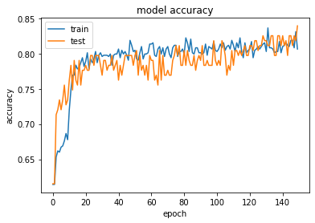
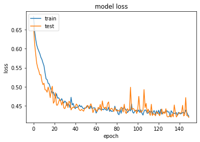
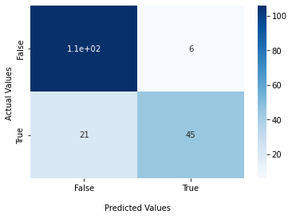

```python
import seaborn as sns
from __future__ import absolute_import, division, print_function, unicode_literals
import functools
import matplotlib.pyplot as plt
from keras.models import Sequential
from keras.layers import Dense
import pandas as pd 
import numpy as np
import tensorflow as tf
from sklearn.model_selection import train_test_split
from sklearn.metrics import confusion_matrix
```


```python
data=pd.read_csv("train.csv")
```


```python
data.head()
```


<div>
<style scoped>
    .dataframe tbody tr th:only-of-type {
        vertical-align: middle;
    }

    .dataframe tbody tr th {
        vertical-align: top;
    }

    .dataframe thead th {
        text-align: right;
    }
</style>
<table border="1" class="dataframe">
  <thead>
    <tr style="text-align: right;">
      <th></th>
      <th>PassengerId</th>
      <th>Survived</th>
      <th>Pclass</th>
      <th>Name</th>
      <th>Sex</th>
      <th>Age</th>
      <th>SibSp</th>
      <th>Parch</th>
      <th>Ticket</th>
      <th>Fare</th>
      <th>Cabin</th>
      <th>Embarked</th>
    </tr>
  </thead>
  <tbody>
    <tr>
      <th>0</th>
      <td>1</td>
      <td>0</td>
      <td>3</td>
      <td>Braund, Mr. Owen Harris</td>
      <td>male</td>
      <td>22.0</td>
      <td>1</td>
      <td>0</td>
      <td>A/5 21171</td>
      <td>7.2500</td>
      <td>NaN</td>
      <td>S</td>
    </tr>
    <tr>
      <th>1</th>
      <td>2</td>
      <td>1</td>
      <td>1</td>
      <td>Cumings, Mrs. John Bradley (Florence Briggs Th...</td>
      <td>female</td>
      <td>38.0</td>
      <td>1</td>
      <td>0</td>
      <td>PC 17599</td>
      <td>71.2833</td>
      <td>C85</td>
      <td>C</td>
    </tr>
    <tr>
      <th>2</th>
      <td>3</td>
      <td>1</td>
      <td>3</td>
      <td>Heikkinen, Miss. Laina</td>
      <td>female</td>
      <td>26.0</td>
      <td>0</td>
      <td>0</td>
      <td>STON/O2. 3101282</td>
      <td>7.9250</td>
      <td>NaN</td>
      <td>S</td>
    </tr>
    <tr>
      <th>3</th>
      <td>4</td>
      <td>1</td>
      <td>1</td>
      <td>Futrelle, Mrs. Jacques Heath (Lily May Peel)</td>
      <td>female</td>
      <td>35.0</td>
      <td>1</td>
      <td>0</td>
      <td>113803</td>
      <td>53.1000</td>
      <td>C123</td>
      <td>S</td>
    </tr>
    <tr>
      <th>4</th>
      <td>5</td>
      <td>0</td>
      <td>3</td>
      <td>Allen, Mr. William Henry</td>
      <td>male</td>
      <td>35.0</td>
      <td>0</td>
      <td>0</td>
      <td>373450</td>
      <td>8.0500</td>
      <td>NaN</td>
      <td>S</td>
    </tr>
  </tbody>
</table>
</div>


```python
def processData(dataFrame):
    dataFrame.drop(["PassengerId", "Ticket", "Name", "Cabin"], inplace=True, axis=1)
    dataFrame = dataFrame.dropna(subset=['Embarked'])
    dataFrame = dataFrame.fillna(data.mean())
    dataFrame['Sex'] = dataFrame['Sex'].map( {'female': 1, 'male': 0} ).astype(int)
    embarked = pd.get_dummies(dataFrame['Embarked'], prefix='Embarked')
    dataFrame = dataFrame.drop('Embarked', axis=1)
    dataFrame = dataFrame.join(embarked)
    return dataFrame
data = processData(data)
data, testData = train_test_split(data, test_size=0.2)
labels = data['Survived'].values
```

    C:\Users\renan\AppData\Local\Temp/ipykernel_23652/2415891344.py:4: FutureWarning: Dropping of nuisance columns in DataFrame reductions (with 'numeric_only=None') is deprecated; in a future version this will raise TypeError.  Select only valid columns before calling the reduction.
      dataFrame = dataFrame.fillna(data.mean())
    


```python
data.isnull().any(axis=0)
```


    Survived      False
    Pclass        False
    Sex           False
    Age           False
    SibSp         False
    Parch         False
    Fare          False
    Embarked_C    False
    Embarked_Q    False
    Embarked_S    False
    dtype: bool


```python
data.isnull().sum(axis=0)
```


    Survived      0
    Pclass        0
    Sex           0
    Age           0
    SibSp         0
    Parch         0
    Fare          0
    Embarked_C    0
    Embarked_Q    0
    Embarked_S    0
    dtype: int64


```python
data = data.drop(['Survived'], axis=1).values.astype(float)
```


```python
model = Sequential()
model.add(Dense(16, input_dim=data.shape[1], kernel_initializer='uniform', activation='relu'))
model.add(Dense(8, kernel_initializer='uniform', activation='relu'))
model.add(Dense(4, kernel_initializer='uniform', activation='relu'))
model.add(Dense(1, kernel_initializer='uniform', activation='sigmoid'))
model.compile(loss='binary_crossentropy', optimizer='adam', metrics=['binary_accuracy'])
history = model.fit(data, labels, epochs=150, batch_size=3, verbose=1,validation_split = 0.2)
```

    Epoch 1/150
    190/190 [==============================] - 1s 2ms/step - loss: 0.6846 - binary_accuracy: 0.6144 - val_loss: 0.6584 - val_binary_accuracy: 0.6154
    Epoch 2/150
    190/190 [==============================] - 0s 1ms/step - loss: 0.6455 - binary_accuracy: 0.6144 - val_loss: 0.6129 - val_binary_accuracy: 0.6154
    Epoch 3/150
    190/190 [==============================] - 0s 1ms/step - loss: 0.6257 - binary_accuracy: 0.6532 - val_loss: 0.5867 - val_binary_accuracy: 0.7133
    Epoch 4/150
    190/190 [==============================] - 0s 1ms/step - loss: 0.6097 - binary_accuracy: 0.6620 - val_loss: 0.5620 - val_binary_accuracy: 0.7203
    Epoch 5/150
    190/190 [==============================] - 0s 1ms/step - loss: 0.6006 - binary_accuracy: 0.6602 - val_loss: 0.5499 - val_binary_accuracy: 0.7343
    Epoch 6/150
    190/190 [==============================] - 0s 1ms/step - loss: 0.5937 - binary_accuracy: 0.6673 - val_loss: 0.5423 - val_binary_accuracy: 0.7203
    Epoch 7/150
    190/190 [==============================] - 0s 1ms/step - loss: 0.5869 - binary_accuracy: 0.6690 - val_loss: 0.5313 - val_binary_accuracy: 0.7343
    Epoch 8/150
    190/190 [==============================] - 0s 1ms/step - loss: 0.5775 - binary_accuracy: 0.6761 - val_loss: 0.5316 - val_binary_accuracy: 0.7552
    Epoch 9/150
    190/190 [==============================] - 0s 1ms/step - loss: 0.5719 - binary_accuracy: 0.6866 - val_loss: 0.5148 - val_binary_accuracy: 0.7273
    Epoch 10/150
    190/190 [==============================] - 0s 1ms/step - loss: 0.5627 - binary_accuracy: 0.6778 - val_loss: 0.5056 - val_binary_accuracy: 0.7343
    Epoch 11/150
    190/190 [==============================] - 0s 1ms/step - loss: 0.5548 - binary_accuracy: 0.7201 - val_loss: 0.5091 - val_binary_accuracy: 0.7622
    Epoch 12/150
    190/190 [==============================] - 0s 1ms/step - loss: 0.5368 - binary_accuracy: 0.7482 - val_loss: 0.4922 - val_binary_accuracy: 0.7832
    Epoch 13/150
    190/190 [==============================] - 0s 1ms/step - loss: 0.5207 - binary_accuracy: 0.7694 - val_loss: 0.4913 - val_binary_accuracy: 0.7483
    Epoch 14/150
    190/190 [==============================] - 0s 1ms/step - loss: 0.5187 - binary_accuracy: 0.7694 - val_loss: 0.4856 - val_binary_accuracy: 0.7902
    Epoch 15/150
    190/190 [==============================] - 0s 1ms/step - loss: 0.5087 - binary_accuracy: 0.7835 - val_loss: 0.4993 - val_binary_accuracy: 0.7622
    Epoch 16/150
    190/190 [==============================] - 0s 1ms/step - loss: 0.5075 - binary_accuracy: 0.7782 - val_loss: 0.4884 - val_binary_accuracy: 0.7552
    Epoch 17/150
    190/190 [==============================] - 0s 1ms/step - loss: 0.4980 - binary_accuracy: 0.7799 - val_loss: 0.4713 - val_binary_accuracy: 0.7902
    Epoch 18/150
    190/190 [==============================] - 0s 1ms/step - loss: 0.4898 - binary_accuracy: 0.7870 - val_loss: 0.4922 - val_binary_accuracy: 0.7552
    Epoch 19/150
    190/190 [==============================] - 0s 1ms/step - loss: 0.4828 - binary_accuracy: 0.7940 - val_loss: 0.5013 - val_binary_accuracy: 0.7762
    Epoch 20/150
    190/190 [==============================] - 0s 1ms/step - loss: 0.4859 - binary_accuracy: 0.7817 - val_loss: 0.4567 - val_binary_accuracy: 0.7762
    Epoch 21/150
    190/190 [==============================] - 0s 1ms/step - loss: 0.4778 - binary_accuracy: 0.7887 - val_loss: 0.4615 - val_binary_accuracy: 0.7832
    Epoch 22/150
    190/190 [==============================] - 0s 1ms/step - loss: 0.4705 - binary_accuracy: 0.8011 - val_loss: 0.4843 - val_binary_accuracy: 0.7762
    Epoch 23/150
    190/190 [==============================] - 0s 1ms/step - loss: 0.4818 - binary_accuracy: 0.7782 - val_loss: 0.4518 - val_binary_accuracy: 0.7762
    Epoch 24/150
    190/190 [==============================] - 0s 1ms/step - loss: 0.4702 - binary_accuracy: 0.7923 - val_loss: 0.4518 - val_binary_accuracy: 0.7972
    Epoch 25/150
    190/190 [==============================] - 0s 1ms/step - loss: 0.4711 - binary_accuracy: 0.7870 - val_loss: 0.4595 - val_binary_accuracy: 0.7972
    Epoch 26/150
    190/190 [==============================] - 0s 1ms/step - loss: 0.4667 - binary_accuracy: 0.7923 - val_loss: 0.4671 - val_binary_accuracy: 0.7832
    Epoch 27/150
    190/190 [==============================] - 0s 1ms/step - loss: 0.4631 - binary_accuracy: 0.8028 - val_loss: 0.4619 - val_binary_accuracy: 0.7972
    Epoch 28/150
    190/190 [==============================] - 0s 1ms/step - loss: 0.4687 - binary_accuracy: 0.7870 - val_loss: 0.4517 - val_binary_accuracy: 0.7972
    Epoch 29/150
    190/190 [==============================] - 0s 1ms/step - loss: 0.4624 - binary_accuracy: 0.7975 - val_loss: 0.4629 - val_binary_accuracy: 0.7972
    Epoch 30/150
    190/190 [==============================] - 0s 1ms/step - loss: 0.4571 - binary_accuracy: 0.8011 - val_loss: 0.4445 - val_binary_accuracy: 0.7832
    Epoch 31/150
    190/190 [==============================] - 0s 1ms/step - loss: 0.4626 - binary_accuracy: 0.7958 - val_loss: 0.4424 - val_binary_accuracy: 0.7692
    Epoch 32/150
    190/190 [==============================] - 0s 1ms/step - loss: 0.4595 - binary_accuracy: 0.7975 - val_loss: 0.4496 - val_binary_accuracy: 0.7902
    Epoch 33/150
    190/190 [==============================] - 0s 1ms/step - loss: 0.4505 - binary_accuracy: 0.7975 - val_loss: 0.4594 - val_binary_accuracy: 0.7902
    Epoch 34/150
    190/190 [==============================] - 0s 1ms/step - loss: 0.4549 - binary_accuracy: 0.7975 - val_loss: 0.4453 - val_binary_accuracy: 0.7762
    Epoch 35/150
    190/190 [==============================] - 0s 1ms/step - loss: 0.4529 - binary_accuracy: 0.7958 - val_loss: 0.4619 - val_binary_accuracy: 0.7832
    Epoch 36/150
    190/190 [==============================] - 0s 1ms/step - loss: 0.4451 - binary_accuracy: 0.7993 - val_loss: 0.4584 - val_binary_accuracy: 0.7832
    Epoch 37/150
    190/190 [==============================] - 0s 1ms/step - loss: 0.4723 - binary_accuracy: 0.7835 - val_loss: 0.4391 - val_binary_accuracy: 0.7972
    Epoch 38/150
    190/190 [==============================] - 0s 1ms/step - loss: 0.4520 - binary_accuracy: 0.7975 - val_loss: 0.4442 - val_binary_accuracy: 0.7762
    Epoch 39/150
    190/190 [==============================] - 0s 1ms/step - loss: 0.4562 - binary_accuracy: 0.7993 - val_loss: 0.4466 - val_binary_accuracy: 0.7832
    Epoch 40/150
    190/190 [==============================] - 0s 1ms/step - loss: 0.4472 - binary_accuracy: 0.7993 - val_loss: 0.4451 - val_binary_accuracy: 0.7902
    Epoch 41/150
    190/190 [==============================] - 0s 1ms/step - loss: 0.4424 - binary_accuracy: 0.8063 - val_loss: 0.4469 - val_binary_accuracy: 0.7622
    Epoch 42/150
    190/190 [==============================] - 0s 1ms/step - loss: 0.4466 - binary_accuracy: 0.7940 - val_loss: 0.4548 - val_binary_accuracy: 0.7832
    Epoch 43/150
    190/190 [==============================] - 0s 1ms/step - loss: 0.4458 - binary_accuracy: 0.8046 - val_loss: 0.4515 - val_binary_accuracy: 0.7692
    Epoch 44/150
    190/190 [==============================] - 0s 1ms/step - loss: 0.4467 - binary_accuracy: 0.7993 - val_loss: 0.4439 - val_binary_accuracy: 0.7832
    Epoch 45/150
    190/190 [==============================] - 0s 1ms/step - loss: 0.4522 - binary_accuracy: 0.8028 - val_loss: 0.4389 - val_binary_accuracy: 0.7972
    Epoch 46/150
    190/190 [==============================] - 0s 1ms/step - loss: 0.4474 - binary_accuracy: 0.7975 - val_loss: 0.4374 - val_binary_accuracy: 0.7972
    Epoch 47/150
    190/190 [==============================] - 0s 1ms/step - loss: 0.4496 - binary_accuracy: 0.7905 - val_loss: 0.4406 - val_binary_accuracy: 0.7972
    Epoch 48/150
    190/190 [==============================] - 0s 1ms/step - loss: 0.4444 - binary_accuracy: 0.8187 - val_loss: 0.4383 - val_binary_accuracy: 0.7972
    Epoch 49/150
    190/190 [==============================] - 0s 1ms/step - loss: 0.4423 - binary_accuracy: 0.8116 - val_loss: 0.4357 - val_binary_accuracy: 0.7972
    Epoch 50/150
    190/190 [==============================] - 0s 1ms/step - loss: 0.4443 - binary_accuracy: 0.8028 - val_loss: 0.4428 - val_binary_accuracy: 0.7832
    Epoch 51/150
    190/190 [==============================] - 0s 1ms/step - loss: 0.4441 - binary_accuracy: 0.8046 - val_loss: 0.4439 - val_binary_accuracy: 0.7972
    Epoch 52/150
    190/190 [==============================] - 0s 1ms/step - loss: 0.4458 - binary_accuracy: 0.7923 - val_loss: 0.4495 - val_binary_accuracy: 0.8042
    Epoch 53/150
    190/190 [==============================] - 0s 1ms/step - loss: 0.4505 - binary_accuracy: 0.7905 - val_loss: 0.4510 - val_binary_accuracy: 0.7692
    Epoch 54/150
    190/190 [==============================] - 0s 1ms/step - loss: 0.4461 - binary_accuracy: 0.8011 - val_loss: 0.4426 - val_binary_accuracy: 0.7972
    Epoch 55/150
    190/190 [==============================] - 0s 1ms/step - loss: 0.4422 - binary_accuracy: 0.8099 - val_loss: 0.4492 - val_binary_accuracy: 0.7762
    Epoch 56/150
    190/190 [==============================] - 0s 1ms/step - loss: 0.4494 - binary_accuracy: 0.7923 - val_loss: 0.4552 - val_binary_accuracy: 0.7832
    Epoch 57/150
    190/190 [==============================] - 0s 1ms/step - loss: 0.4426 - binary_accuracy: 0.7993 - val_loss: 0.4465 - val_binary_accuracy: 0.7692
    Epoch 58/150
    190/190 [==============================] - 0s 1ms/step - loss: 0.4440 - binary_accuracy: 0.7993 - val_loss: 0.4320 - val_binary_accuracy: 0.7832
    Epoch 59/150
    190/190 [==============================] - 0s 1ms/step - loss: 0.4445 - binary_accuracy: 0.8011 - val_loss: 0.4398 - val_binary_accuracy: 0.7622
    Epoch 60/150
    190/190 [==============================] - 0s 1ms/step - loss: 0.4441 - binary_accuracy: 0.8134 - val_loss: 0.4425 - val_binary_accuracy: 0.7972
    Epoch 61/150
    190/190 [==============================] - 0s 1ms/step - loss: 0.4307 - binary_accuracy: 0.8134 - val_loss: 0.4386 - val_binary_accuracy: 0.7902
    Epoch 62/150
    190/190 [==============================] - 0s 1ms/step - loss: 0.4356 - binary_accuracy: 0.8151 - val_loss: 0.4347 - val_binary_accuracy: 0.7902
    Epoch 63/150
    190/190 [==============================] - 0s 1ms/step - loss: 0.4406 - binary_accuracy: 0.7975 - val_loss: 0.4458 - val_binary_accuracy: 0.7622
    Epoch 64/150
    190/190 [==============================] - 0s 1ms/step - loss: 0.4420 - binary_accuracy: 0.7958 - val_loss: 0.4419 - val_binary_accuracy: 0.7692
    Epoch 65/150
    190/190 [==============================] - 0s 1ms/step - loss: 0.4414 - binary_accuracy: 0.8063 - val_loss: 0.4535 - val_binary_accuracy: 0.7552
    Epoch 66/150
    190/190 [==============================] - 0s 1ms/step - loss: 0.4388 - binary_accuracy: 0.8099 - val_loss: 0.4368 - val_binary_accuracy: 0.8042
    Epoch 67/150
    190/190 [==============================] - 0s 1ms/step - loss: 0.4411 - binary_accuracy: 0.7993 - val_loss: 0.4628 - val_binary_accuracy: 0.7622
    Epoch 68/150
    190/190 [==============================] - 0s 1ms/step - loss: 0.4394 - binary_accuracy: 0.8081 - val_loss: 0.4463 - val_binary_accuracy: 0.7972
    Epoch 69/150
    190/190 [==============================] - 0s 1ms/step - loss: 0.4424 - binary_accuracy: 0.7958 - val_loss: 0.4433 - val_binary_accuracy: 0.7692
    Epoch 70/150
    190/190 [==============================] - 0s 1ms/step - loss: 0.4409 - binary_accuracy: 0.8063 - val_loss: 0.4467 - val_binary_accuracy: 0.7692
    Epoch 71/150
    190/190 [==============================] - 0s 1ms/step - loss: 0.4381 - binary_accuracy: 0.8099 - val_loss: 0.4403 - val_binary_accuracy: 0.7762
    Epoch 72/150
    190/190 [==============================] - 0s 1ms/step - loss: 0.4387 - binary_accuracy: 0.7993 - val_loss: 0.4560 - val_binary_accuracy: 0.7692
    Epoch 73/150
    190/190 [==============================] - 0s 1ms/step - loss: 0.4463 - binary_accuracy: 0.7940 - val_loss: 0.4601 - val_binary_accuracy: 0.7692
    Epoch 74/150
    190/190 [==============================] - 0s 1ms/step - loss: 0.4352 - binary_accuracy: 0.8081 - val_loss: 0.4386 - val_binary_accuracy: 0.7902
    Epoch 75/150
    190/190 [==============================] - 0s 1ms/step - loss: 0.4383 - binary_accuracy: 0.8116 - val_loss: 0.4417 - val_binary_accuracy: 0.7972
    Epoch 76/150
    190/190 [==============================] - 0s 1ms/step - loss: 0.4349 - binary_accuracy: 0.8116 - val_loss: 0.4435 - val_binary_accuracy: 0.8112
    Epoch 77/150
    190/190 [==============================] - 0s 1ms/step - loss: 0.4362 - binary_accuracy: 0.7958 - val_loss: 0.4400 - val_binary_accuracy: 0.7972
    Epoch 78/150
    190/190 [==============================] - 0s 1ms/step - loss: 0.4366 - binary_accuracy: 0.8028 - val_loss: 0.4350 - val_binary_accuracy: 0.8112
    Epoch 79/150
    190/190 [==============================] - 0s 1ms/step - loss: 0.4489 - binary_accuracy: 0.8028 - val_loss: 0.4449 - val_binary_accuracy: 0.7832
    Epoch 80/150
    190/190 [==============================] - 0s 1ms/step - loss: 0.4387 - binary_accuracy: 0.8063 - val_loss: 0.4385 - val_binary_accuracy: 0.7832
    Epoch 81/150
    190/190 [==============================] - 0s 1ms/step - loss: 0.4402 - binary_accuracy: 0.7993 - val_loss: 0.4359 - val_binary_accuracy: 0.8042
    Epoch 82/150
    190/190 [==============================] - 0s 1ms/step - loss: 0.4292 - binary_accuracy: 0.8222 - val_loss: 0.4385 - val_binary_accuracy: 0.7832
    Epoch 83/150
    190/190 [==============================] - 0s 1ms/step - loss: 0.4265 - binary_accuracy: 0.8151 - val_loss: 0.4356 - val_binary_accuracy: 0.8042
    Epoch 84/150
    190/190 [==============================] - 0s 1ms/step - loss: 0.4417 - binary_accuracy: 0.8028 - val_loss: 0.4382 - val_binary_accuracy: 0.7902
    Epoch 85/150
    190/190 [==============================] - 0s 1ms/step - loss: 0.4302 - binary_accuracy: 0.8204 - val_loss: 0.4465 - val_binary_accuracy: 0.7832
    Epoch 86/150
    190/190 [==============================] - 0s 1ms/step - loss: 0.4443 - binary_accuracy: 0.8011 - val_loss: 0.4435 - val_binary_accuracy: 0.7832
    Epoch 87/150
    190/190 [==============================] - 0s 1ms/step - loss: 0.4431 - binary_accuracy: 0.7993 - val_loss: 0.4335 - val_binary_accuracy: 0.7972
    Epoch 88/150
    190/190 [==============================] - 0s 1ms/step - loss: 0.4452 - binary_accuracy: 0.8081 - val_loss: 0.4541 - val_binary_accuracy: 0.7762
    Epoch 89/150
    190/190 [==============================] - 0s 1ms/step - loss: 0.4413 - binary_accuracy: 0.8081 - val_loss: 0.4334 - val_binary_accuracy: 0.7902
    Epoch 90/150
    190/190 [==============================] - 0s 1ms/step - loss: 0.4392 - binary_accuracy: 0.8011 - val_loss: 0.4294 - val_binary_accuracy: 0.7972
    Epoch 91/150
    190/190 [==============================] - 0s 1ms/step - loss: 0.4322 - binary_accuracy: 0.8011 - val_loss: 0.4423 - val_binary_accuracy: 0.7902
    Epoch 92/150
    190/190 [==============================] - 0s 1ms/step - loss: 0.4353 - binary_accuracy: 0.7993 - val_loss: 0.4376 - val_binary_accuracy: 0.8112
    Epoch 93/150
    190/190 [==============================] - 0s 1ms/step - loss: 0.4401 - binary_accuracy: 0.8011 - val_loss: 0.4394 - val_binary_accuracy: 0.7832
    Epoch 94/150
    190/190 [==============================] - 0s 1ms/step - loss: 0.4365 - binary_accuracy: 0.8134 - val_loss: 0.4987 - val_binary_accuracy: 0.7832
    Epoch 95/150
    190/190 [==============================] - 0s 1ms/step - loss: 0.4550 - binary_accuracy: 0.7975 - val_loss: 0.4396 - val_binary_accuracy: 0.7902
    Epoch 96/150
    190/190 [==============================] - 0s 1ms/step - loss: 0.4338 - binary_accuracy: 0.8099 - val_loss: 0.4429 - val_binary_accuracy: 0.7832
    Epoch 97/150
    190/190 [==============================] - 0s 1ms/step - loss: 0.4304 - binary_accuracy: 0.8081 - val_loss: 0.4427 - val_binary_accuracy: 0.7832
    Epoch 98/150
    190/190 [==============================] - 0s 1ms/step - loss: 0.4352 - binary_accuracy: 0.8063 - val_loss: 0.4371 - val_binary_accuracy: 0.7832
    Epoch 99/150
    190/190 [==============================] - 0s 1ms/step - loss: 0.4369 - binary_accuracy: 0.8169 - val_loss: 0.4385 - val_binary_accuracy: 0.8182
    Epoch 100/150
    190/190 [==============================] - 0s 1ms/step - loss: 0.4386 - binary_accuracy: 0.8046 - val_loss: 0.4297 - val_binary_accuracy: 0.7902
    Epoch 101/150
    190/190 [==============================] - 0s 1ms/step - loss: 0.4347 - binary_accuracy: 0.8028 - val_loss: 0.4428 - val_binary_accuracy: 0.7832
    Epoch 102/150
    190/190 [==============================] - 0s 1ms/step - loss: 0.4391 - binary_accuracy: 0.8063 - val_loss: 0.4747 - val_binary_accuracy: 0.7902
    Epoch 103/150
    190/190 [==============================] - 0s 1ms/step - loss: 0.4323 - binary_accuracy: 0.8134 - val_loss: 0.4409 - val_binary_accuracy: 0.7832
    Epoch 104/150
    190/190 [==============================] - 0s 1ms/step - loss: 0.4393 - binary_accuracy: 0.8081 - val_loss: 0.4327 - val_binary_accuracy: 0.8182
    Epoch 105/150
    190/190 [==============================] - 0s 1ms/step - loss: 0.4305 - binary_accuracy: 0.8151 - val_loss: 0.4354 - val_binary_accuracy: 0.8112
    Epoch 106/150
    190/190 [==============================] - 0s 1ms/step - loss: 0.4256 - binary_accuracy: 0.8046 - val_loss: 0.4386 - val_binary_accuracy: 0.7972
    Epoch 107/150
    190/190 [==============================] - 0s 1ms/step - loss: 0.4354 - binary_accuracy: 0.8099 - val_loss: 0.4926 - val_binary_accuracy: 0.7692
    Epoch 108/150
    190/190 [==============================] - 0s 1ms/step - loss: 0.4394 - binary_accuracy: 0.8116 - val_loss: 0.4451 - val_binary_accuracy: 0.7832
    Epoch 109/150
    190/190 [==============================] - 0s 2ms/step - loss: 0.4370 - binary_accuracy: 0.8063 - val_loss: 0.4563 - val_binary_accuracy: 0.7762
    Epoch 110/150
    190/190 [==============================] - 0s 1ms/step - loss: 0.4301 - binary_accuracy: 0.8187 - val_loss: 0.4318 - val_binary_accuracy: 0.8042
    Epoch 111/150
    190/190 [==============================] - 0s 1ms/step - loss: 0.4312 - binary_accuracy: 0.8116 - val_loss: 0.4412 - val_binary_accuracy: 0.7832
    Epoch 112/150
    190/190 [==============================] - 0s 1ms/step - loss: 0.4366 - binary_accuracy: 0.8028 - val_loss: 0.4313 - val_binary_accuracy: 0.8042
    Epoch 113/150
    190/190 [==============================] - 0s 1ms/step - loss: 0.4324 - binary_accuracy: 0.8151 - val_loss: 0.4247 - val_binary_accuracy: 0.8042
    Epoch 114/150
    190/190 [==============================] - 0s 1ms/step - loss: 0.4361 - binary_accuracy: 0.8081 - val_loss: 0.4539 - val_binary_accuracy: 0.7972
    Epoch 115/150
    190/190 [==============================] - 0s 1ms/step - loss: 0.4256 - binary_accuracy: 0.8222 - val_loss: 0.4244 - val_binary_accuracy: 0.8042
    Epoch 116/150
    190/190 [==============================] - 0s 1ms/step - loss: 0.4361 - binary_accuracy: 0.8028 - val_loss: 0.4292 - val_binary_accuracy: 0.7972
    Epoch 117/150
    190/190 [==============================] - 0s 1ms/step - loss: 0.4366 - binary_accuracy: 0.7940 - val_loss: 0.4275 - val_binary_accuracy: 0.8042
    Epoch 118/150
    190/190 [==============================] - 0s 1ms/step - loss: 0.4267 - binary_accuracy: 0.8151 - val_loss: 0.4237 - val_binary_accuracy: 0.8112
    Epoch 119/150
    190/190 [==============================] - 0s 1ms/step - loss: 0.4368 - binary_accuracy: 0.8011 - val_loss: 0.4338 - val_binary_accuracy: 0.7972
    Epoch 120/150
    190/190 [==============================] - 0s 1ms/step - loss: 0.4291 - binary_accuracy: 0.8046 - val_loss: 0.4330 - val_binary_accuracy: 0.7972
    Epoch 121/150
    190/190 [==============================] - 0s 1ms/step - loss: 0.4382 - binary_accuracy: 0.8063 - val_loss: 0.4285 - val_binary_accuracy: 0.8112
    Epoch 122/150
    190/190 [==============================] - 0s 1ms/step - loss: 0.4280 - binary_accuracy: 0.8169 - val_loss: 0.4239 - val_binary_accuracy: 0.8112
    Epoch 123/150
    190/190 [==============================] - 0s 1ms/step - loss: 0.4408 - binary_accuracy: 0.7940 - val_loss: 0.4330 - val_binary_accuracy: 0.8042
    Epoch 124/150
    190/190 [==============================] - 0s 1ms/step - loss: 0.4280 - binary_accuracy: 0.8046 - val_loss: 0.4415 - val_binary_accuracy: 0.8182
    Epoch 125/150
    190/190 [==============================] - 0s 1ms/step - loss: 0.4329 - binary_accuracy: 0.8063 - val_loss: 0.4283 - val_binary_accuracy: 0.8182
    Epoch 126/150
    190/190 [==============================] - 0s 1ms/step - loss: 0.4325 - binary_accuracy: 0.8099 - val_loss: 0.4343 - val_binary_accuracy: 0.8042
    Epoch 127/150
    190/190 [==============================] - 0s 1ms/step - loss: 0.4331 - binary_accuracy: 0.8063 - val_loss: 0.4295 - val_binary_accuracy: 0.8112
    Epoch 128/150
    190/190 [==============================] - 0s 1ms/step - loss: 0.4339 - binary_accuracy: 0.8099 - val_loss: 0.4423 - val_binary_accuracy: 0.8112
    Epoch 129/150
    190/190 [==============================] - 0s 1ms/step - loss: 0.4370 - binary_accuracy: 0.8134 - val_loss: 0.4225 - val_binary_accuracy: 0.8252
    Epoch 130/150
    190/190 [==============================] - 0s 1ms/step - loss: 0.4333 - binary_accuracy: 0.8151 - val_loss: 0.4206 - val_binary_accuracy: 0.8182
    Epoch 131/150
    190/190 [==============================] - 0s 1ms/step - loss: 0.4339 - binary_accuracy: 0.8028 - val_loss: 0.4223 - val_binary_accuracy: 0.8182
    Epoch 132/150
    190/190 [==============================] - 0s 1ms/step - loss: 0.4211 - binary_accuracy: 0.8363 - val_loss: 0.4261 - val_binary_accuracy: 0.8112
    Epoch 133/150
    190/190 [==============================] - 0s 1ms/step - loss: 0.4369 - binary_accuracy: 0.8081 - val_loss: 0.4202 - val_binary_accuracy: 0.8112
    Epoch 134/150
    190/190 [==============================] - 0s 1ms/step - loss: 0.4328 - binary_accuracy: 0.8081 - val_loss: 0.4287 - val_binary_accuracy: 0.8252
    Epoch 135/150
    190/190 [==============================] - 0s 1ms/step - loss: 0.4294 - binary_accuracy: 0.8063 - val_loss: 0.4209 - val_binary_accuracy: 0.8252
    Epoch 136/150
    190/190 [==============================] - 0s 1ms/step - loss: 0.4304 - binary_accuracy: 0.8011 - val_loss: 0.4522 - val_binary_accuracy: 0.7972
    Epoch 137/150
    190/190 [==============================] - 0s 1ms/step - loss: 0.4295 - binary_accuracy: 0.8028 - val_loss: 0.4334 - val_binary_accuracy: 0.7972
    Epoch 138/150
    190/190 [==============================] - 0s 1ms/step - loss: 0.4320 - binary_accuracy: 0.8028 - val_loss: 0.4206 - val_binary_accuracy: 0.8252
    Epoch 139/150
    190/190 [==============================] - 0s 1ms/step - loss: 0.4245 - binary_accuracy: 0.8169 - val_loss: 0.4246 - val_binary_accuracy: 0.8252
    Epoch 140/150
    190/190 [==============================] - 0s 1ms/step - loss: 0.4327 - binary_accuracy: 0.8011 - val_loss: 0.4295 - val_binary_accuracy: 0.8112
    Epoch 141/150
    190/190 [==============================] - 0s 1ms/step - loss: 0.4300 - binary_accuracy: 0.8099 - val_loss: 0.4321 - val_binary_accuracy: 0.8252
    Epoch 142/150
    190/190 [==============================] - 0s 1ms/step - loss: 0.4285 - binary_accuracy: 0.8116 - val_loss: 0.4299 - val_binary_accuracy: 0.8112
    Epoch 143/150
    190/190 [==============================] - 0s 1ms/step - loss: 0.4299 - binary_accuracy: 0.8151 - val_loss: 0.4327 - val_binary_accuracy: 0.8182
    Epoch 144/150
    190/190 [==============================] - 0s 1ms/step - loss: 0.4323 - binary_accuracy: 0.8116 - val_loss: 0.4512 - val_binary_accuracy: 0.7972
    Epoch 145/150
    190/190 [==============================] - 0s 1ms/step - loss: 0.4325 - binary_accuracy: 0.8099 - val_loss: 0.4233 - val_binary_accuracy: 0.8252
    Epoch 146/150
    190/190 [==============================] - 0s 1ms/step - loss: 0.4291 - binary_accuracy: 0.8187 - val_loss: 0.4258 - val_binary_accuracy: 0.8252
    Epoch 147/150
    190/190 [==============================] - 0s 1ms/step - loss: 0.4388 - binary_accuracy: 0.8187 - val_loss: 0.4715 - val_binary_accuracy: 0.8112
    Epoch 148/150
    190/190 [==============================] - 0s 1ms/step - loss: 0.4328 - binary_accuracy: 0.8081 - val_loss: 0.4241 - val_binary_accuracy: 0.8252
    Epoch 149/150
    190/190 [==============================] - 0s 1ms/step - loss: 0.4264 - binary_accuracy: 0.8310 - val_loss: 0.4237 - val_binary_accuracy: 0.8182
    Epoch 150/150
    190/190 [==============================] - 0s 1ms/step - loss: 0.4227 - binary_accuracy: 0.8063 - val_loss: 0.4193 - val_binary_accuracy: 0.8392
    


```python
plt.plot(history.history['binary_accuracy'])
plt.plot(history.history['val_binary_accuracy'])
plt.title('model accuracy')
plt.ylabel('accuracy')
plt.xlabel('epoch')
plt.legend(['train', 'test'], loc='upper left')
plt.show()
```


    

    


```python
plt.plot(history.history['loss'])
plt.plot(history.history['val_loss'])
plt.title('model loss')
plt.ylabel('loss')
plt.xlabel('epoch')
plt.legend(['train', 'test'], loc='upper left')
plt.show()
```


    

    


```python
def print_confusion_matrix(confusion_matrix, axes, class_label, class_names, fontsize=14):

    df_cm = pd.DataFrame(
        confusion_matrix, index=class_names, columns=class_names,
    )

    try:
        heatmap = sns.heatmap(df_cm, annot=True, fmt="d", cbar=False, ax=axes)
    except ValueError:
        raise ValueError("Confusion matrix values must be integers.")
    heatmap.yaxis.set_ticklabels(heatmap.yaxis.get_ticklabels(), rotation=0, ha='right', fontsize=fontsize)
    heatmap.xaxis.set_ticklabels(heatmap.xaxis.get_ticklabels(), rotation=45, ha='right', fontsize=fontsize)
    axes.set_ylabel('True label')
    axes.set_xlabel('Predicted label')
    axes.set_title("Confusion Matrix for the class - " + class_label)

```


```python
testLabels = testData['Survived'].values
testData = testData.drop(['Survived'], axis=1).values.astype(float)
test_results = model.evaluate(testData, testLabels, verbose=1)
print(f'Test results - Loss: {test_results[0]} - Accuracy: {test_results[1]}%')
```

    6/6 [==============================] - 0s 1ms/step - loss: 0.3783 - binary_accuracy: 0.8483
    Test results - Loss: 0.3782860338687897 - Accuracy: 0.8483145833015442%
    


```python

predLabels = (model.predict(testData)>0.5)
matrix = confusion_matrix(testLabels, predLabels)

ax = sns.heatmap(matrix, annot=True, cmap='Blues')
ax.set_xlabel('\nPredicted Values')
ax.set_ylabel('Actual Values ');

## Ticket labels - List must be in alphabetical order
ax.xaxis.set_ticklabels(['False','True'])
ax.yaxis.set_ticklabels(['False','True'])

## Display the visualization of the Confusion Matrix.
plt.show()
```


    

    


```python

```
