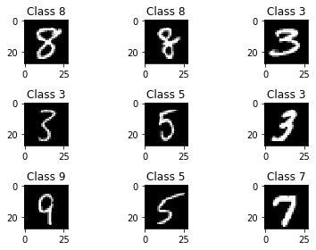
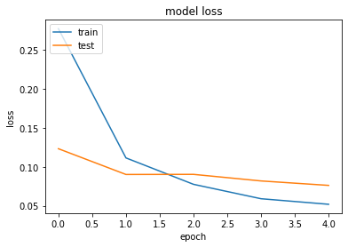
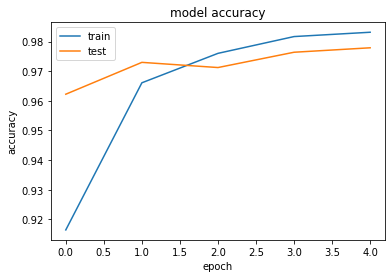
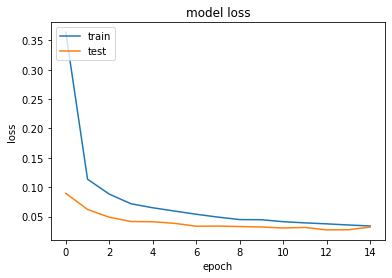
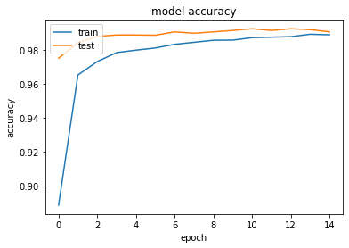

```python
import numpy as np
import matplotlib.pyplot as plt
import random
import keras
from keras.datasets import mnist
from keras.models import Sequential
from tensorflow.keras import layers
from keras.layers.core import Dense, Dropout, Activation 
from keras.utils import np_utils
```


```python
(X_train, y_train), (X_test, y_test) = mnist.load_data()
```


```python
for i in range(9):
    plt.subplot(3,3,i+1)
    num = random.randint(0, len(X_train))
    plt.imshow(X_train[num], cmap='gray', interpolation='none')
    plt.title("Class {}".format(y_train[num]))
    
plt.tight_layout()
```


    

    


```python
def matprint(mat, fmt="g"):
    col_maxes = [max([len(("{:"+fmt+"}").format(x)) for x in col]) for col in mat.T]
    for x in mat:
        for i, y in enumerate(x):
            print(("{:"+str(col_maxes[i])+fmt+"}").format(y), end="  ")
        print("")

# now print!        
matprint(X_train[num])
```

    0  0  0  0  0   0    0    0    0    0    0    0    0    0    0    0    0    0    0    0   0  0  0  0  0  0  0  0  
    0  0  0  0  0   0    0    0    0    0    0    0    0    0    0    0    0    0    0    0   0  0  0  0  0  0  0  0  
    0  0  0  0  0   0    0    0    0    0    0    0    0    0    0    0    0    0    0    0   0  0  0  0  0  0  0  0  
    0  0  0  0  0   0    0    0    0    0    0    0    0    0    0    0    0    0    0    0   0  0  0  0  0  0  0  0  
    0  0  0  0  0   0    0    0    0    0    0    0    0    0    0    0    0    0    0    0   0  0  0  0  0  0  0  0  
    0  0  0  0  0   0    0    0    0    0    0    0    0    0    0    0    0    0    0    0   0  0  0  0  0  0  0  0  
    0  0  0  0  0   0    0    0    0    0    0    0    0    0    0    0    0    0    0    0   0  0  0  0  0  0  0  0  
    0  0  0  0  0   0    0    0   51  113  222  253  253  255  253  174  253  253  255  253  56  0  0  0  0  0  0  0  
    0  0  0  0  0   0   10  163  238  252  252  252  252  253  252  252  252  252  253  252  55  0  0  0  0  0  0  0  
    0  0  0  0  0   0   60  252  253  252  252  252  252  253  252  252  252  252  253  252  55  0  0  0  0  0  0  0  
    0  0  0  0  0   7  178  252  253  252  230  223  223  225  223  223  223  239  253  252  55  0  0  0  0  0  0  0  
    0  0  0  0  0  57  252  252  253  127   25    0    0    0    0    0   16  203  253  252  55  0  0  0  0  0  0  0  
    0  0  0  0  0  57  253  253  141    0    0    0    0    0    0    0   29  253  255  253  56  0  0  0  0  0  0  0  
    0  0  0  0  0   6  168  167   15    0    0    0    0    0    0    0  154  252  253  223  37  0  0  0  0  0  0  0  
    0  0  0  0  0   0   31    0    0    0    0    0    0    0    0   13  187  252  253  167   0  0  0  0  0  0  0  0  
    0  0  0  0  0   0    0    0    0    0    0    0    0    0    0  150  252  252  253   74   0  0  0  0  0  0  0  0  
    0  0  0  0  0   0    0    0    0    0    0    0    0    0    0  197  252  252  253   27   0  0  0  0  0  0  0  0  
    0  0  0  0  0   0    0    0    0    0    0    0    0    0   85  253  253  253  141    0   0  0  0  0  0  0  0  0  
    0  0  0  0  0   0    0    0    0    0    0    0    0   38  219  252  252  252   94    0   0  0  0  0  0  0  0  0  
    0  0  0  0  0   0    0    0    0    0    0    0    0  113  252  252  252  141    0    0   0  0  0  0  0  0  0  0  
    0  0  0  0  0   0    0    0    0    0    0    0    0  207  252  252  233   37    0    0   0  0  0  0  0  0  0  0  
    0  0  0  0  0   0    0    0    0    0    0    0   79  253  252  252  223    0    0    0   0  0  0  0  0  0  0  0  
    0  0  0  0  0   0    0    0    0    0    0   29  253  255  253  228   47    0    0    0   0  0  0  0  0  0  0  0  
    0  0  0  0  0   0    0    0    0    0    0  154  252  253  252  148    0    0    0    0   0  0  0  0  0  0  0  0  
    0  0  0  0  0   0    0    0    0    0    0  169  252  253  252   55    0    0    0    0   0  0  0  0  0  0  0  0  
    0  0  0  0  0   0    0    0    0    0    0  153  252  253  195   19    0    0    0    0   0  0  0  0  0  0  0  0  
    0  0  0  0  0   0    0    0    0    0    0   29  252  190   74    0    0    0    0    0   0  0  0  0  0  0  0  0  
    0  0  0  0  0   0    0    0    0    0    0    0    0    0    0    0    0    0    0    0   0  0  0  0  0  0  0  0  
    


```python
# Flattening data
X_train_flat = X_train.reshape(60000, 784)
X_test_flat = X_test.reshape(10000, 784)

X_train_flat = X_train_flat.astype('float32')
X_test_flat = X_test_flat.astype('float32')

# Normalization
X_train_flat /= 255
X_test_flat /= 255

print("Training matrix shape", X_train_flat.shape)
print("Testing matrix shape", X_test_flat.shape)
```

    Training matrix shape (60000, 784)
    Testing matrix shape (10000, 784)
    


```python
nb_classes = 10

Y_train = np_utils.to_categorical(y_train, nb_classes)
Y_test = np_utils.to_categorical(y_test, nb_classes)
```


```python
model = Sequential()
model.add(Dense(512, input_shape=(784,), activation='relu'))
model.add(Dropout(0.2))
model.add(Dense(512, activation='relu'))
model.add(Dropout(0.2))
model.add(Dense(10, activation='softmax'))
model.summary()
```

    Model: "sequential"
    _________________________________________________________________
     Layer (type)                Output Shape              Param #   
    =================================================================
     dense (Dense)               (None, 512)               401920    
                                                                     
     dropout (Dropout)           (None, 512)               0         
                                                                     
     dense_1 (Dense)             (None, 512)               262656    
                                                                     
     dropout_1 (Dropout)         (None, 512)               0         
                                                                     
     dense_2 (Dense)             (None, 10)                5130      
                                                                     
    =================================================================
    Total params: 669,706
    Trainable params: 669,706
    Non-trainable params: 0
    _________________________________________________________________
    


```python
model.compile(loss='categorical_crossentropy', optimizer='adam', metrics=['accuracy'])
```


```python
history = model.fit(X_train_flat, Y_train, batch_size=128, epochs=5, verbose=1, validation_split = 0.2)
```

    Epoch 1/5
    375/375 [==============================] - 3s 8ms/step - loss: 0.2773 - accuracy: 0.9164 - val_loss: 0.1232 - val_accuracy: 0.9622
    Epoch 2/5
    375/375 [==============================] - 3s 7ms/step - loss: 0.1114 - accuracy: 0.9661 - val_loss: 0.0901 - val_accuracy: 0.9730
    Epoch 3/5
    375/375 [==============================] - 3s 7ms/step - loss: 0.0775 - accuracy: 0.9760 - val_loss: 0.0903 - val_accuracy: 0.9712
    Epoch 4/5
    375/375 [==============================] - 3s 7ms/step - loss: 0.0590 - accuracy: 0.9817 - val_loss: 0.0818 - val_accuracy: 0.9764
    Epoch 5/5
    375/375 [==============================] - 3s 7ms/step - loss: 0.0519 - accuracy: 0.9832 - val_loss: 0.0761 - val_accuracy: 0.9779
    


```python
plt.plot(history.history['loss'])
plt.plot(history.history['val_loss'])
plt.title('model loss')
plt.ylabel('loss')
plt.xlabel('epoch')
plt.legend(['train', 'test'], loc='upper left')
plt.show()
```


    

    


```python
plt.plot(history.history['accuracy'])
plt.plot(history.history['val_accuracy'])
plt.title('model accuracy')
plt.ylabel('accuracy')
plt.xlabel('epoch')
plt.legend(['train', 'test'], loc='upper left')
plt.show()
```


    

    


```python
score = model.evaluate(X_test_flat, Y_test)
print('Test score:', score[0])
print('Test accuracy:', score[1])
```

    313/313 [==============================] - 0s 1ms/step - loss: 0.0662 - accuracy: 0.9785
    Test score: 0.06618456542491913
    Test accuracy: 0.9785000085830688
    

# Convolutional


```python
X_train = X_train.astype("float32") / 255
X_test = X_test.astype("float32") / 255
# Make sure images have shape (28, 28, 1)
X_train = np.expand_dims(X_train, -1)
X_test = np.expand_dims(X_test, -1)
print("x_train shape:", X_train.shape)
print(X_train.shape[0], "train samples")
print(X_test.shape[0], "test samples")
```

    x_train shape: (60000, 28, 28, 1)
    60000 train samples
    10000 test samples
    


```python
input_shape = (28, 28, 1)
cnn = keras.Sequential(
    [
        keras.Input(shape=input_shape),
        layers.Conv2D(32, kernel_size=(3, 3), activation="relu"),
        layers.MaxPooling2D(pool_size=(2, 2)),
        layers.Conv2D(64, kernel_size=(3, 3), activation="relu"),
        layers.MaxPooling2D(pool_size=(2, 2)),
        layers.Flatten(),
        layers.Dropout(0.5),
        layers.Dense(nb_classes, activation="softmax"),
    ]
)
cnn.summary()
```

    Model: "sequential_1"
    _________________________________________________________________
     Layer (type)                Output Shape              Param #   
    =================================================================
     conv2d (Conv2D)             (None, 26, 26, 32)        320       
                                                                     
     max_pooling2d (MaxPooling2D  (None, 13, 13, 32)       0         
     )                                                               
                                                                     
     conv2d_1 (Conv2D)           (None, 11, 11, 64)        18496     
                                                                     
     max_pooling2d_1 (MaxPooling  (None, 5, 5, 64)         0         
     2D)                                                             
                                                                     
     flatten (Flatten)           (None, 1600)              0         
                                                                     
     dropout_2 (Dropout)         (None, 1600)              0         
                                                                     
     dense_3 (Dense)             (None, 10)                16010     
                                                                     
    =================================================================
    Total params: 34,826
    Trainable params: 34,826
    Non-trainable params: 0
    _________________________________________________________________
    


```python
batch_size = 128
epochs = 15

cnn.compile(loss="categorical_crossentropy", optimizer="adam", metrics=["accuracy"])

cnnHistory = cnn.fit(X_train, Y_train, batch_size=batch_size, epochs=epochs, validation_split=0.1)
```

    Epoch 1/15
    422/422 [==============================] - 15s 34ms/step - loss: 0.3639 - accuracy: 0.8886 - val_loss: 0.0896 - val_accuracy: 0.9750
    Epoch 2/15
    422/422 [==============================] - 15s 35ms/step - loss: 0.1137 - accuracy: 0.9651 - val_loss: 0.0622 - val_accuracy: 0.9842
    Epoch 3/15
    422/422 [==============================] - 15s 35ms/step - loss: 0.0883 - accuracy: 0.9730 - val_loss: 0.0489 - val_accuracy: 0.9878
    Epoch 4/15
    422/422 [==============================] - 15s 35ms/step - loss: 0.0718 - accuracy: 0.9783 - val_loss: 0.0417 - val_accuracy: 0.9887
    Epoch 5/15
    422/422 [==============================] - 14s 34ms/step - loss: 0.0650 - accuracy: 0.9797 - val_loss: 0.0412 - val_accuracy: 0.9887
    Epoch 6/15
    422/422 [==============================] - 14s 34ms/step - loss: 0.0595 - accuracy: 0.9810 - val_loss: 0.0386 - val_accuracy: 0.9885
    Epoch 7/15
    422/422 [==============================] - 14s 34ms/step - loss: 0.0540 - accuracy: 0.9832 - val_loss: 0.0336 - val_accuracy: 0.9905
    Epoch 8/15
    422/422 [==============================] - 14s 34ms/step - loss: 0.0491 - accuracy: 0.9844 - val_loss: 0.0339 - val_accuracy: 0.9897
    Epoch 9/15
    422/422 [==============================] - 14s 34ms/step - loss: 0.0450 - accuracy: 0.9856 - val_loss: 0.0331 - val_accuracy: 0.9905
    Epoch 10/15
    422/422 [==============================] - 15s 34ms/step - loss: 0.0447 - accuracy: 0.9856 - val_loss: 0.0323 - val_accuracy: 0.9913
    Epoch 11/15
    422/422 [==============================] - 16s 38ms/step - loss: 0.0413 - accuracy: 0.9871 - val_loss: 0.0306 - val_accuracy: 0.9923
    Epoch 12/15
    422/422 [==============================] - 15s 35ms/step - loss: 0.0393 - accuracy: 0.9874 - val_loss: 0.0316 - val_accuracy: 0.9913
    Epoch 13/15
    422/422 [==============================] - 15s 35ms/step - loss: 0.0377 - accuracy: 0.9877 - val_loss: 0.0273 - val_accuracy: 0.9923
    Epoch 14/15
    422/422 [==============================] - 14s 34ms/step - loss: 0.0357 - accuracy: 0.9891 - val_loss: 0.0277 - val_accuracy: 0.9918
    Epoch 15/15
    422/422 [==============================] - 15s 35ms/step - loss: 0.0340 - accuracy: 0.9888 - val_loss: 0.0322 - val_accuracy: 0.9905
    


```python
score = cnn.evaluate(X_test, Y_test, verbose=0)
print("Test loss:", score[0])
print("Test accuracy:", score[1])
```

    Test loss: 0.024699022993445396
    Test accuracy: 0.9922000169754028
    


```python
plt.plot(cnnHistory.history['loss'])
plt.plot(cnnHistory.history['val_loss'])
plt.title('model loss')
plt.ylabel('loss')
plt.xlabel('epoch')
plt.legend(['train', 'test'], loc='upper left')
plt.show()
```


    

    


```python
plt.plot(cnnHistory.history['accuracy'])
plt.plot(cnnHistory.history['val_accuracy'])
plt.title('model accuracy')
plt.ylabel('accuracy')
plt.xlabel('epoch')
plt.legend(['train', 'test'], loc='upper left')
plt.show()
```


    

    


```python

```
