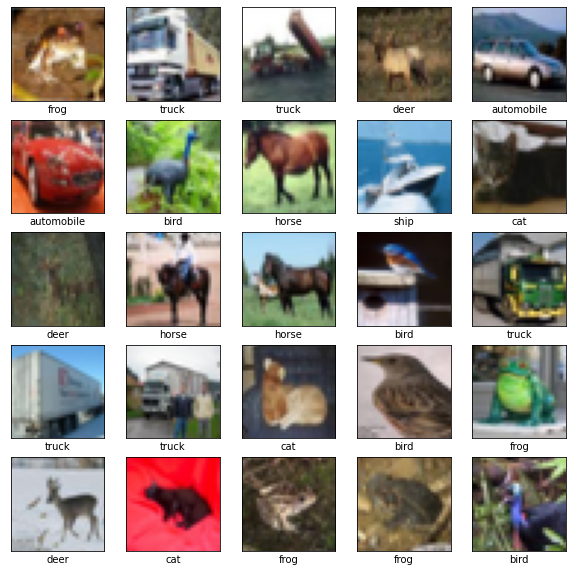
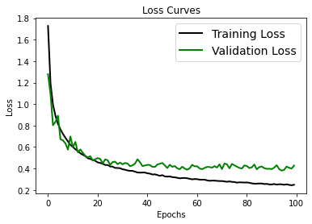
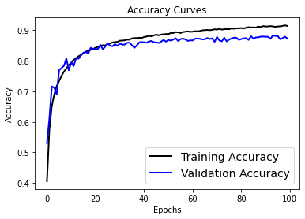
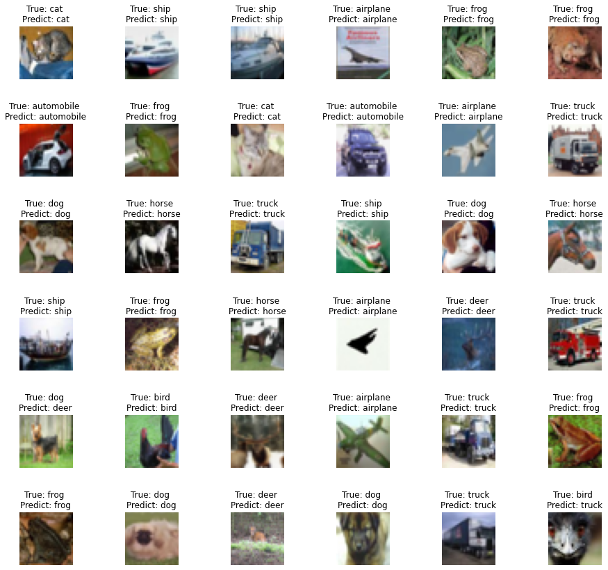

```python
import keras
from keras.datasets import cifar10
from keras.models import Sequential
from keras import datasets, layers, models
from keras.utils import np_utils
from keras import regularizers
from keras.layers import Dense, Dropout, BatchNormalization
import matplotlib.pyplot as plt
import numpy as np
import tensorflow as tf
```


```python
print("Num GPUs Available: ", len(tf.config.list_physical_devices('GPU')))
```

    Num GPUs Available:  1
    


```python
(train_images, train_labels), (test_images, test_labels) = datasets.cifar10.load_data()
```


```python
class_names = ['airplane', 'automobile', 'bird', 'cat', 'deer',
               'dog', 'frog', 'horse', 'ship', 'truck']
```


```python
plt.figure(figsize=[10,10])
for i in range (25):    # for first 25 images
  plt.subplot(5, 5, i+1)
  plt.xticks([])
  plt.yticks([])
  plt.grid(False)
  plt.imshow(train_images[i], cmap=plt.cm.binary)
  plt.xlabel(class_names[train_labels[i][0]])

plt.show()
```


    

    


```python
train_images = train_images.astype('float32')
test_images = test_images.astype('float32')
train_images = train_images / 255
test_images = test_images / 255 
num_classes = 10
train_labels = np_utils.to_categorical(train_labels, num_classes)
test_labels = np_utils.to_categorical(test_labels, num_classes)
```


```python
model = Sequential()

model.add(layers.Conv2D(32, (3,3), padding='same', activation='relu', input_shape=(32,32,3)))
model.add(layers.BatchNormalization())
model.add(layers.Conv2D(32, (3,3), padding='same', activation='relu'))
model.add(layers.BatchNormalization())
model.add(layers.MaxPooling2D(pool_size=(2,2)))
model.add(layers.Dropout(0.3))

model.add(layers.Conv2D(64, (3,3), padding='same', activation='relu'))
model.add(layers.BatchNormalization())
model.add(layers.Conv2D(64, (3,3), padding='same', activation='relu'))
model.add(layers.BatchNormalization())
model.add(layers.MaxPooling2D(pool_size=(2,2)))
model.add(layers.Dropout(0.5))

model.add(layers.Conv2D(128, (3,3), padding='same', activation='relu'))
model.add(layers.BatchNormalization())
model.add(layers.Conv2D(128, (3,3), padding='same', activation='relu'))
model.add(layers.BatchNormalization())
model.add(layers.MaxPooling2D(pool_size=(2,2)))
model.add(layers.Dropout(0.5))

model.add(layers.Flatten())
model.add(layers.Dense(128, activation='relu'))
model.add(layers.BatchNormalization())
model.add(layers.Dropout(0.5))
model.add(layers.Dense(num_classes, activation='softmax'))

model.summary()
```

    Model: "sequential"
    _________________________________________________________________
     Layer (type)                Output Shape              Param #   
    =================================================================
     conv2d (Conv2D)             (None, 32, 32, 32)        896       
                                                                     
     batch_normalization (BatchN  (None, 32, 32, 32)       128       
     ormalization)                                                   
                                                                     
     conv2d_1 (Conv2D)           (None, 32, 32, 32)        9248      
                                                                     
     batch_normalization_1 (Batc  (None, 32, 32, 32)       128       
     hNormalization)                                                 
                                                                     
     max_pooling2d (MaxPooling2D  (None, 16, 16, 32)       0         
     )                                                               
                                                                     
     dropout (Dropout)           (None, 16, 16, 32)        0         
                                                                     
     conv2d_2 (Conv2D)           (None, 16, 16, 64)        18496     
                                                                     
     batch_normalization_2 (Batc  (None, 16, 16, 64)       256       
     hNormalization)                                                 
                                                                     
     conv2d_3 (Conv2D)           (None, 16, 16, 64)        36928     
                                                                     
     batch_normalization_3 (Batc  (None, 16, 16, 64)       256       
     hNormalization)                                                 
                                                                     
     max_pooling2d_1 (MaxPooling  (None, 8, 8, 64)         0         
     2D)                                                             
                                                                     
     dropout_1 (Dropout)         (None, 8, 8, 64)          0         
                                                                     
     conv2d_4 (Conv2D)           (None, 8, 8, 128)         73856     
                                                                     
     batch_normalization_4 (Batc  (None, 8, 8, 128)        512       
     hNormalization)                                                 
                                                                     
     conv2d_5 (Conv2D)           (None, 8, 8, 128)         147584    
                                                                     
     batch_normalization_5 (Batc  (None, 8, 8, 128)        512       
     hNormalization)                                                 
                                                                     
     max_pooling2d_2 (MaxPooling  (None, 4, 4, 128)        0         
     2D)                                                             
                                                                     
     dropout_2 (Dropout)         (None, 4, 4, 128)         0         
                                                                     
     flatten (Flatten)           (None, 2048)              0         
                                                                     
     dense (Dense)               (None, 128)               262272    
                                                                     
     batch_normalization_6 (Batc  (None, 128)              512       
     hNormalization)                                                 
                                                                     
     dropout_3 (Dropout)         (None, 128)               0         
                                                                     
     dense_1 (Dense)             (None, 10)                1290      
                                                                     
    =================================================================
    Total params: 552,874
    Trainable params: 551,722
    Non-trainable params: 1,152
    _________________________________________________________________
    


```python
model.compile(optimizer='adam', loss=keras.losses.categorical_crossentropy, metrics=['accuracy'])

history = model.fit(train_images, train_labels, batch_size=64, epochs=100,
                    validation_data=(test_images, test_labels))

```

    Epoch 1/100
    782/782 [==============================] - 14s 12ms/step - loss: 1.7280 - accuracy: 0.4062 - val_loss: 1.2790 - val_accuracy: 0.5297
    Epoch 2/100
    782/782 [==============================] - 9s 11ms/step - loss: 1.1931 - accuracy: 0.5752 - val_loss: 1.0943 - val_accuracy: 0.6112
    Epoch 3/100
    782/782 [==============================] - 9s 12ms/step - loss: 0.9929 - accuracy: 0.6519 - val_loss: 0.8027 - val_accuracy: 0.7156
    Epoch 4/100
    782/782 [==============================] - 9s 12ms/step - loss: 0.8902 - accuracy: 0.6888 - val_loss: 0.8360 - val_accuracy: 0.7118
    Epoch 5/100
    782/782 [==============================] - 9s 12ms/step - loss: 0.8165 - accuracy: 0.7168 - val_loss: 0.8918 - val_accuracy: 0.6892
    Epoch 6/100
    782/782 [==============================] - 9s 12ms/step - loss: 0.7644 - accuracy: 0.7336 - val_loss: 0.6723 - val_accuracy: 0.7688
    Epoch 7/100
    782/782 [==============================] - 9s 12ms/step - loss: 0.7222 - accuracy: 0.7505 - val_loss: 0.6624 - val_accuracy: 0.7759
    Epoch 8/100
    782/782 [==============================] - 9s 12ms/step - loss: 0.6863 - accuracy: 0.7643 - val_loss: 0.6342 - val_accuracy: 0.7833
    Epoch 9/100
    782/782 [==============================] - 9s 12ms/step - loss: 0.6526 - accuracy: 0.7743 - val_loss: 0.5760 - val_accuracy: 0.8072
    Epoch 10/100
    782/782 [==============================] - 9s 12ms/step - loss: 0.6196 - accuracy: 0.7860 - val_loss: 0.6987 - val_accuracy: 0.7686
    Epoch 11/100
    782/782 [==============================] - 9s 12ms/step - loss: 0.6005 - accuracy: 0.7930 - val_loss: 0.5979 - val_accuracy: 0.7937
    Epoch 12/100
    782/782 [==============================] - 10s 13ms/step - loss: 0.5798 - accuracy: 0.8030 - val_loss: 0.6476 - val_accuracy: 0.7822
    Epoch 13/100
    782/782 [==============================] - 10s 12ms/step - loss: 0.5625 - accuracy: 0.8074 - val_loss: 0.5506 - val_accuracy: 0.8090
    Epoch 14/100
    782/782 [==============================] - 10s 12ms/step - loss: 0.5419 - accuracy: 0.8144 - val_loss: 0.5777 - val_accuracy: 0.8062
    Epoch 15/100
    782/782 [==============================] - 9s 12ms/step - loss: 0.5280 - accuracy: 0.8186 - val_loss: 0.5469 - val_accuracy: 0.8176
    Epoch 16/100
    782/782 [==============================] - 9s 12ms/step - loss: 0.5156 - accuracy: 0.8240 - val_loss: 0.5178 - val_accuracy: 0.8260
    Epoch 17/100
    782/782 [==============================] - 9s 12ms/step - loss: 0.4958 - accuracy: 0.8293 - val_loss: 0.5039 - val_accuracy: 0.8286
    Epoch 18/100
    782/782 [==============================] - 9s 12ms/step - loss: 0.4891 - accuracy: 0.8330 - val_loss: 0.5148 - val_accuracy: 0.8229
    Epoch 19/100
    782/782 [==============================] - 9s 12ms/step - loss: 0.4795 - accuracy: 0.8352 - val_loss: 0.4742 - val_accuracy: 0.8422
    Epoch 20/100
    782/782 [==============================] - 9s 12ms/step - loss: 0.4716 - accuracy: 0.8385 - val_loss: 0.4860 - val_accuracy: 0.8380
    Epoch 21/100
    782/782 [==============================] - 9s 12ms/step - loss: 0.4568 - accuracy: 0.8422 - val_loss: 0.4971 - val_accuracy: 0.8372
    Epoch 22/100
    782/782 [==============================] - 9s 12ms/step - loss: 0.4519 - accuracy: 0.8452 - val_loss: 0.4893 - val_accuracy: 0.8385
    Epoch 23/100
    782/782 [==============================] - 9s 12ms/step - loss: 0.4435 - accuracy: 0.8478 - val_loss: 0.4474 - val_accuracy: 0.8521
    Epoch 24/100
    782/782 [==============================] - 9s 12ms/step - loss: 0.4328 - accuracy: 0.8503 - val_loss: 0.4843 - val_accuracy: 0.8372
    Epoch 25/100
    782/782 [==============================] - 9s 12ms/step - loss: 0.4323 - accuracy: 0.8499 - val_loss: 0.4765 - val_accuracy: 0.8460
    Epoch 26/100
    782/782 [==============================] - 10s 13ms/step - loss: 0.4190 - accuracy: 0.8546 - val_loss: 0.4340 - val_accuracy: 0.8565
    Epoch 27/100
    782/782 [==============================] - 11s 14ms/step - loss: 0.4172 - accuracy: 0.8562 - val_loss: 0.4596 - val_accuracy: 0.8486
    Epoch 28/100
    782/782 [==============================] - 11s 14ms/step - loss: 0.4052 - accuracy: 0.8594 - val_loss: 0.4638 - val_accuracy: 0.8471
    Epoch 29/100
    782/782 [==============================] - 11s 14ms/step - loss: 0.4048 - accuracy: 0.8608 - val_loss: 0.4405 - val_accuracy: 0.8542
    Epoch 30/100
    782/782 [==============================] - 11s 14ms/step - loss: 0.4026 - accuracy: 0.8613 - val_loss: 0.4549 - val_accuracy: 0.8483
    Epoch 31/100
    782/782 [==============================] - 10s 13ms/step - loss: 0.3930 - accuracy: 0.8653 - val_loss: 0.4388 - val_accuracy: 0.8556
    Epoch 32/100
    782/782 [==============================] - 10s 13ms/step - loss: 0.3883 - accuracy: 0.8657 - val_loss: 0.4513 - val_accuracy: 0.8524
    Epoch 33/100
    782/782 [==============================] - 10s 13ms/step - loss: 0.3815 - accuracy: 0.8666 - val_loss: 0.4462 - val_accuracy: 0.8526
    Epoch 34/100
    782/782 [==============================] - 10s 12ms/step - loss: 0.3782 - accuracy: 0.8687 - val_loss: 0.4216 - val_accuracy: 0.8584
    Epoch 35/100
    782/782 [==============================] - 10s 12ms/step - loss: 0.3778 - accuracy: 0.8688 - val_loss: 0.4292 - val_accuracy: 0.8589
    Epoch 36/100
    782/782 [==============================] - 10s 12ms/step - loss: 0.3702 - accuracy: 0.8730 - val_loss: 0.4451 - val_accuracy: 0.8505
    Epoch 37/100
    782/782 [==============================] - 10s 13ms/step - loss: 0.3627 - accuracy: 0.8740 - val_loss: 0.4860 - val_accuracy: 0.8419
    Epoch 38/100
    782/782 [==============================] - 10s 13ms/step - loss: 0.3613 - accuracy: 0.8737 - val_loss: 0.4579 - val_accuracy: 0.8501
    Epoch 39/100
    782/782 [==============================] - 10s 13ms/step - loss: 0.3623 - accuracy: 0.8750 - val_loss: 0.4232 - val_accuracy: 0.8599
    Epoch 40/100
    782/782 [==============================] - 10s 13ms/step - loss: 0.3622 - accuracy: 0.8742 - val_loss: 0.4276 - val_accuracy: 0.8604
    Epoch 41/100
    782/782 [==============================] - 10s 12ms/step - loss: 0.3553 - accuracy: 0.8775 - val_loss: 0.4343 - val_accuracy: 0.8602
    Epoch 42/100
    782/782 [==============================] - 10s 12ms/step - loss: 0.3522 - accuracy: 0.8790 - val_loss: 0.4320 - val_accuracy: 0.8588
    Epoch 43/100
    782/782 [==============================] - 10s 13ms/step - loss: 0.3438 - accuracy: 0.8815 - val_loss: 0.4159 - val_accuracy: 0.8626
    Epoch 44/100
    782/782 [==============================] - 10s 13ms/step - loss: 0.3460 - accuracy: 0.8796 - val_loss: 0.4145 - val_accuracy: 0.8645
    Epoch 45/100
    782/782 [==============================] - 10s 12ms/step - loss: 0.3389 - accuracy: 0.8825 - val_loss: 0.4367 - val_accuracy: 0.8603
    Epoch 46/100
    782/782 [==============================] - 10s 12ms/step - loss: 0.3318 - accuracy: 0.8852 - val_loss: 0.4442 - val_accuracy: 0.8597
    Epoch 47/100
    782/782 [==============================] - 10s 13ms/step - loss: 0.3383 - accuracy: 0.8828 - val_loss: 0.4516 - val_accuracy: 0.8577
    Epoch 48/100
    782/782 [==============================] - 10s 13ms/step - loss: 0.3263 - accuracy: 0.8854 - val_loss: 0.4293 - val_accuracy: 0.8623
    Epoch 49/100
    782/782 [==============================] - 10s 13ms/step - loss: 0.3244 - accuracy: 0.8862 - val_loss: 0.4043 - val_accuracy: 0.8679
    Epoch 50/100
    782/782 [==============================] - 10s 13ms/step - loss: 0.3257 - accuracy: 0.8871 - val_loss: 0.4348 - val_accuracy: 0.8623
    Epoch 51/100
    782/782 [==============================] - 10s 12ms/step - loss: 0.3199 - accuracy: 0.8873 - val_loss: 0.4155 - val_accuracy: 0.8679
    Epoch 52/100
    782/782 [==============================] - 10s 13ms/step - loss: 0.3175 - accuracy: 0.8902 - val_loss: 0.4229 - val_accuracy: 0.8654
    Epoch 53/100
    782/782 [==============================] - 10s 13ms/step - loss: 0.3136 - accuracy: 0.8905 - val_loss: 0.4020 - val_accuracy: 0.8691
    Epoch 54/100
    782/782 [==============================] - 10s 12ms/step - loss: 0.3082 - accuracy: 0.8934 - val_loss: 0.3932 - val_accuracy: 0.8735
    Epoch 55/100
    782/782 [==============================] - 10s 12ms/step - loss: 0.3110 - accuracy: 0.8925 - val_loss: 0.4167 - val_accuracy: 0.8645
    Epoch 56/100
    782/782 [==============================] - 10s 13ms/step - loss: 0.3117 - accuracy: 0.8905 - val_loss: 0.3992 - val_accuracy: 0.8706
    Epoch 57/100
    782/782 [==============================] - 10s 13ms/step - loss: 0.3088 - accuracy: 0.8938 - val_loss: 0.3887 - val_accuracy: 0.8723
    Epoch 58/100
    782/782 [==============================] - 10s 12ms/step - loss: 0.3038 - accuracy: 0.8947 - val_loss: 0.4014 - val_accuracy: 0.8696
    Epoch 59/100
    782/782 [==============================] - 10s 13ms/step - loss: 0.2988 - accuracy: 0.8957 - val_loss: 0.4343 - val_accuracy: 0.8647
    Epoch 60/100
    782/782 [==============================] - 10s 13ms/step - loss: 0.3017 - accuracy: 0.8943 - val_loss: 0.4205 - val_accuracy: 0.8664
    Epoch 61/100
    782/782 [==============================] - 11s 13ms/step - loss: 0.3005 - accuracy: 0.8948 - val_loss: 0.4204 - val_accuracy: 0.8663
    Epoch 62/100
    782/782 [==============================] - 10s 13ms/step - loss: 0.2960 - accuracy: 0.8964 - val_loss: 0.4002 - val_accuracy: 0.8719
    Epoch 63/100
    782/782 [==============================] - 10s 13ms/step - loss: 0.2957 - accuracy: 0.8958 - val_loss: 0.3937 - val_accuracy: 0.8721
    Epoch 64/100
    782/782 [==============================] - 10s 13ms/step - loss: 0.2961 - accuracy: 0.8970 - val_loss: 0.4050 - val_accuracy: 0.8716
    Epoch 65/100
    782/782 [==============================] - 10s 13ms/step - loss: 0.2890 - accuracy: 0.8991 - val_loss: 0.4151 - val_accuracy: 0.8696
    Epoch 66/100
    782/782 [==============================] - 10s 12ms/step - loss: 0.2855 - accuracy: 0.9000 - val_loss: 0.4131 - val_accuracy: 0.8698
    Epoch 67/100
    782/782 [==============================] - 10s 12ms/step - loss: 0.2868 - accuracy: 0.9005 - val_loss: 0.4080 - val_accuracy: 0.8742
    Epoch 68/100
    782/782 [==============================] - 10s 12ms/step - loss: 0.2869 - accuracy: 0.8997 - val_loss: 0.4216 - val_accuracy: 0.8709
    Epoch 69/100
    782/782 [==============================] - 10s 13ms/step - loss: 0.2847 - accuracy: 0.9006 - val_loss: 0.4090 - val_accuracy: 0.8730
    Epoch 70/100
    782/782 [==============================] - 10s 12ms/step - loss: 0.2829 - accuracy: 0.9027 - val_loss: 0.4384 - val_accuracy: 0.8615
    Epoch 71/100
    782/782 [==============================] - 10s 13ms/step - loss: 0.2831 - accuracy: 0.9017 - val_loss: 0.3947 - val_accuracy: 0.8776
    Epoch 72/100
    782/782 [==============================] - 10s 13ms/step - loss: 0.2797 - accuracy: 0.9039 - val_loss: 0.4462 - val_accuracy: 0.8659
    Epoch 73/100
    782/782 [==============================] - 10s 13ms/step - loss: 0.2764 - accuracy: 0.9016 - val_loss: 0.4394 - val_accuracy: 0.8634
    Epoch 74/100
    782/782 [==============================] - 10s 13ms/step - loss: 0.2796 - accuracy: 0.9029 - val_loss: 0.4012 - val_accuracy: 0.8751
    Epoch 75/100
    782/782 [==============================] - 10s 13ms/step - loss: 0.2752 - accuracy: 0.9033 - val_loss: 0.4429 - val_accuracy: 0.8631
    Epoch 76/100
    782/782 [==============================] - 10s 13ms/step - loss: 0.2744 - accuracy: 0.9029 - val_loss: 0.4291 - val_accuracy: 0.8692
    Epoch 77/100
    782/782 [==============================] - 10s 13ms/step - loss: 0.2681 - accuracy: 0.9055 - val_loss: 0.4168 - val_accuracy: 0.8725
    Epoch 78/100
    782/782 [==============================] - 10s 13ms/step - loss: 0.2713 - accuracy: 0.9044 - val_loss: 0.4057 - val_accuracy: 0.8753
    Epoch 79/100
    782/782 [==============================] - 10s 13ms/step - loss: 0.2700 - accuracy: 0.9057 - val_loss: 0.4001 - val_accuracy: 0.8749
    Epoch 80/100
    782/782 [==============================] - 10s 13ms/step - loss: 0.2691 - accuracy: 0.9059 - val_loss: 0.4283 - val_accuracy: 0.8682
    Epoch 81/100
    782/782 [==============================] - 11s 14ms/step - loss: 0.2698 - accuracy: 0.9067 - val_loss: 0.4238 - val_accuracy: 0.8707
    Epoch 82/100
    782/782 [==============================] - 10s 13ms/step - loss: 0.2670 - accuracy: 0.9052 - val_loss: 0.4038 - val_accuracy: 0.8730
    Epoch 83/100
    782/782 [==============================] - 10s 13ms/step - loss: 0.2613 - accuracy: 0.9079 - val_loss: 0.4100 - val_accuracy: 0.8737
    Epoch 84/100
    782/782 [==============================] - 10s 12ms/step - loss: 0.2585 - accuracy: 0.9095 - val_loss: 0.4369 - val_accuracy: 0.8679
    Epoch 85/100
    782/782 [==============================] - 10s 12ms/step - loss: 0.2587 - accuracy: 0.9085 - val_loss: 0.3924 - val_accuracy: 0.8803
    Epoch 86/100
    782/782 [==============================] - 10s 13ms/step - loss: 0.2601 - accuracy: 0.9087 - val_loss: 0.4130 - val_accuracy: 0.8719
    Epoch 87/100
    782/782 [==============================] - 10s 12ms/step - loss: 0.2603 - accuracy: 0.9082 - val_loss: 0.4188 - val_accuracy: 0.8761
    Epoch 88/100
    782/782 [==============================] - 10s 12ms/step - loss: 0.2551 - accuracy: 0.9114 - val_loss: 0.4035 - val_accuracy: 0.8765
    Epoch 89/100
    782/782 [==============================] - 10s 12ms/step - loss: 0.2566 - accuracy: 0.9098 - val_loss: 0.3968 - val_accuracy: 0.8787
    Epoch 90/100
    782/782 [==============================] - 10s 13ms/step - loss: 0.2517 - accuracy: 0.9129 - val_loss: 0.3977 - val_accuracy: 0.8789
    Epoch 91/100
    782/782 [==============================] - 10s 13ms/step - loss: 0.2511 - accuracy: 0.9118 - val_loss: 0.3939 - val_accuracy: 0.8783
    Epoch 92/100
    782/782 [==============================] - 10s 12ms/step - loss: 0.2550 - accuracy: 0.9120 - val_loss: 0.4077 - val_accuracy: 0.8783
    Epoch 93/100
    782/782 [==============================] - 10s 13ms/step - loss: 0.2503 - accuracy: 0.9130 - val_loss: 0.4307 - val_accuracy: 0.8716
    Epoch 94/100
    782/782 [==============================] - 10s 13ms/step - loss: 0.2529 - accuracy: 0.9121 - val_loss: 0.3947 - val_accuracy: 0.8824
    Epoch 95/100
    782/782 [==============================] - 10s 13ms/step - loss: 0.2524 - accuracy: 0.9106 - val_loss: 0.3803 - val_accuracy: 0.8808
    Epoch 96/100
    782/782 [==============================] - 10s 13ms/step - loss: 0.2481 - accuracy: 0.9118 - val_loss: 0.3868 - val_accuracy: 0.8808
    Epoch 97/100
    782/782 [==============================] - 10s 13ms/step - loss: 0.2525 - accuracy: 0.9123 - val_loss: 0.4178 - val_accuracy: 0.8703
    Epoch 98/100
    782/782 [==============================] - 10s 13ms/step - loss: 0.2475 - accuracy: 0.9137 - val_loss: 0.4070 - val_accuracy: 0.8738
    Epoch 99/100
    782/782 [==============================] - 10s 13ms/step - loss: 0.2437 - accuracy: 0.9153 - val_loss: 0.3989 - val_accuracy: 0.8784
    Epoch 100/100
    782/782 [==============================] - 10s 13ms/step - loss: 0.2483 - accuracy: 0.9135 - val_loss: 0.4274 - val_accuracy: 0.8724
    


```python
plt.figure(figsize=[6,4])
plt.plot(history.history['loss'], 'black', linewidth=2.0)
plt.plot(history.history['val_loss'], 'green', linewidth=2.0)
plt.legend(['Training Loss', 'Validation Loss'], fontsize=14)
plt.xlabel('Epochs', fontsize=10)
plt.ylabel('Loss', fontsize=10)
plt.title('Loss Curves', fontsize=12)
```


    Text(0.5, 1.0, 'Loss Curves')


    

    


```python
plt.figure(figsize=[6,4])
plt.plot(history.history['accuracy'], 'black', linewidth=2.0)
plt.plot(history.history['val_accuracy'], 'blue', linewidth=2.0)
plt.legend(['Training Accuracy', 'Validation Accuracy'], fontsize=14)
plt.xlabel('Epochs', fontsize=10)
plt.ylabel('Accuracy', fontsize=10)
plt.title('Accuracy Curves', fontsize=12)
```


    Text(0.5, 1.0, 'Accuracy Curves')


    

    


```python
pred = model.predict(test_images)
pred_classes = np.argmax(pred, axis=1)
fig, axes = plt.subplots(6, 6, figsize=(15,15))
axes = axes.ravel()

for i in np.arange(0, 36):
    axes[i].imshow(test_images[i])
    axes[i].set_title("True: %s \nPredict: %s" % (class_names[np.argmax(test_labels[i])], class_names[pred_classes[i]]))
    axes[i].axis('off')
    plt.subplots_adjust(wspace=1)

```


    

    


```python

```
